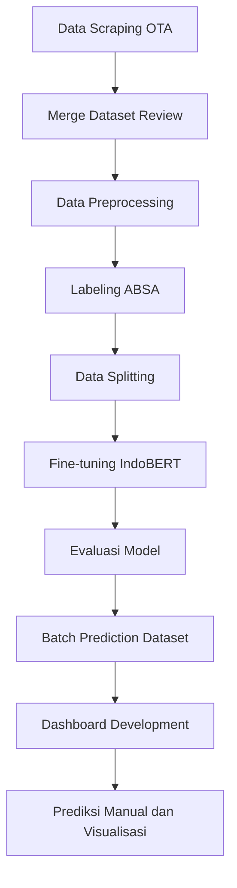

# ABSA Hotel Santika West Java

Repository ini berisi proyek tugas akhir untuk membangun sistem Dashboard
Aspect-Based Sentiment Analysis (ABSA) pada ulasan Online Travel Agent (OTA)
Hotel Santika di Jawa Barat. Sistem menggunakan model IndoBERT yang telah
di-fine-tune untuk mendeteksi sentimen berdasarkan tujuh aspek layanan hotel,
kemudian menyajikan hasilnya dalam dashboard interaktif.

## Ringkasan Proyek

Tujuan utama proyek ini adalah membantu proses evaluasi layanan hotel melalui
analisis ulasan pelanggan yang tersebar di beberapa platform OTA. Alih-alih
hanya melihat sentimen umum, sistem memecah analisis ke dalam aspek layanan
seperti lokasi, kenyamanan, pelayanan, kebersihan, harga, makanan, dan
fasilitas.

Dashboard yang dikembangkan berfungsi sebagai sistem pendukung analisis untuk:

- Menampilkan ringkasan sentimen pelanggan secara cepat.
- Membandingkan sentimen berdasarkan aspek layanan.
- Mengeksplorasi review berdasarkan hotel, platform, waktu, sentimen, aspek,
  dan kata kunci.
- Menjalankan prediksi manual untuk review baru menggunakan model IndoBERT.
- Menampilkan performa model agar hasil prediksi dapat dibaca secara lebih
  transparan.

## Pipeline Pengerjaan



| Tahap | Deskripsi | Output Utama |
| --- | --- | --- |
| Data Scraping OTA | Mengambil review Hotel Santika dari platform OTA seperti Agoda, Traveloka, dan Tiket. | File CSV review per hotel dan platform |
| Merge Dataset Review | Menggabungkan seluruh hasil scraping menjadi satu dataset utama. | `dataset_absa_santika_raw.csv` |
| Data Preprocessing | Membersihkan review, menghapus data duplikat/kosong, dan merapikan atribut hotel, platform, tanggal, dan teks. | `dataset_absa_santika_clean.csv` |
| Labeling ABSA | Memberi label aspek dan sentimen pada dataset untuk kebutuhan training model. | `dataset_absa_labeled.csv` |
| Data Splitting | Membagi data menjadi train, validation, test, dan no-aspect. | `train.csv`, `validation.csv`, `test.csv`, `no_aspect.csv` |
| Fine-tuning IndoBERT | Melatih IndoBERT dengan arsitektur multi-head classifier untuk tujuh aspek layanan. | Folder `best_absa_indobert` |
| Evaluasi Model | Mengukur performa model menggunakan Macro F1, Weighted F1, Accuracy, Non-none Macro F1, Aspect Detection F1, dan False Aspect Rate. | File laporan evaluasi model |
| Batch Prediction Dataset | Menjalankan model pada dataset untuk menghasilkan prediksi aspek dan sentimen. | `dataset_with_predictions.csv` |
| Dashboard Development | Mengembangkan dashboard Flask dengan visualisasi, filter, autentikasi, dan prediksi manual. | Aplikasi lokal di `Dashboard/` |

## Aspek dan Label

Model memprediksi tujuh aspek layanan:

- Lokasi
- Kenyamanan
- Pelayanan
- Kebersihan
- Harga
- Makanan
- Fasilitas

Setiap aspek memiliki empat kemungkinan label:

- `none`: aspek tidak terdeteksi pada review
- `positif`: sentimen positif
- `negatif`: sentimen negatif
- `netral`: sentimen netral

## Performa Model Saat Ini

Model terbaik sementara adalah IndoBERT fine-tune v2 dengan arsitektur
multi-head classifier. Ringkasan performa:

| Metrik | Nilai | Catatan |
| --- | ---: | --- |
| Macro F1 | 74.18% | Lebih seimbang untuk membaca performa antar kelas |
| Accuracy | 92.39% | Tinggi, tetapi dipengaruhi dominasi label `none` |
| Weighted F1 | 92.45% | Baik untuk gambaran umum |
| Non-none Macro F1 | 66.83% | Lebih relevan saat aspek benar-benar muncul |
| Aspect Detection F1 | 92.08% | Model cukup kuat mendeteksi kemunculan aspek |
| False Aspect Rate | 4.81% | Tingkat salah deteksi aspek relatif rendah |

Performa per aspek menunjukkan bahwa Lokasi dan Makanan menjadi aspek yang
relatif kuat, sedangkan Fasilitas, Kebersihan, dan Kenyamanan masih menjadi
prioritas evaluasi lanjutan.

## Fitur Dashboard

Dashboard Flask berada pada folder `Dashboard/` dan memiliki fitur utama:

- Login internal dengan role Admin/Peneliti dan Manajemen Hotel.
- Overview ringkas jumlah review, hotel, platform, aspek, dan sentimen positif.
- Insight prioritas perbaikan, risiko tertinggi, dan kekuatan utama.
- Analisis sentimen per aspek layanan.
- Perbandingan analisis berdasarkan hotel dan platform OTA.
- Tren sentimen berdasarkan waktu.
- Review explorer dengan filter hotel, platform, aspek, sentimen, dan keyword.
- Prediksi manual review baru menggunakan model IndoBERT.
- Halaman performa model dengan metrik dan visualisasi evaluasi.
- Tema terang dan gelap.
- Desain UI profesional dengan ikon SVG dan visualisasi Chart.js.

## Struktur Folder

```text
ABSA Hotel Santika/
├── Dashboard/
│   ├── app.py
│   ├── templates/
│   └── static/
├── Data Scraping/
│   ├── Agoda/
│   ├── Tiket/
│   ├── Traveloka/
│   └── Kode Scrap Otomatis/
├── Data Preprocessing/
├── Data Labeling/
├── Data Splitting/
├── Fine Tuning/
│   └── best_absa_indobert/
├── batch_predict.py
├── validate_model.py
└── dataset_with_predictions.csv
```

## Menjalankan Dashboard Lokal

### 1. Clone repository

```bash
git clone https://github.com/Cendedez/absa_hotel_santika_west_java.git
cd absa_hotel_santika_west_java
```

Jika model `.pt` disimpan melalui Git LFS, jalankan:

```bash
git lfs install
git lfs pull
```

### 2. Siapkan environment Python

Contoh menggunakan virtual environment:

```bash
python -m venv .venv
.venv\Scripts\activate
pip install flask pandas numpy torch transformers scikit-learn
```

Jika menggunakan notebook fine-tuning atau preprocessing, tambahkan:

```bash
pip install jupyter matplotlib seaborn
```

### 3. Jalankan dashboard

```bash
cd Dashboard
python app.py
```

Buka browser ke:

```text
http://127.0.0.1:5000/
```

## Konfigurasi Login Lokal

Dashboard menggunakan autentikasi sederhana untuk kebutuhan demo lokal
penelitian. Password dapat diatur melalui environment variable:

```powershell
$env:ABSA_DASHBOARD_SECRET="ganti-dengan-secret-lokal"
$env:ABSA_ADMIN_PASSWORD="password-admin-lokal"
$env:ABSA_MANAJEMEN_PASSWORD="password-manajemen-lokal"
python Dashboard\app.py
```

Catatan: jangan gunakan password demo untuk deployment publik. Untuk penggunaan
produksi, mekanisme autentikasi perlu diganti dengan sistem yang lebih aman.

## Script Utilitas

### Validasi model

```bash
python validate_model.py
```

Script ini digunakan untuk memastikan model IndoBERT dapat dimuat dan melakukan
inferensi.

### Batch prediction

```bash
python batch_predict.py
```

Script ini menjalankan model pada dataset berlabel dan menghasilkan
`dataset_with_predictions.csv` yang digunakan oleh dashboard.

Catatan: beberapa script utilitas masih memakai path lokal Windows pada bagian
konfigurasi. Jika proyek dipindahkan ke komputer lain, sesuaikan nilai
`MODEL_DIR`, `DATASET_PATH`, dan `OUTPUT_PATH` pada script terkait.

## Scope Sistem

Sistem ini difokuskan pada:

- Analisis historis ulasan OTA Hotel Santika di Jawa Barat.
- Prediksi aspek dan sentimen menggunakan model IndoBERT fine-tune.
- Visualisasi hasil prediksi dalam bentuk dashboard.
- Prediksi manual untuk review baru.

Sistem ini tidak difokuskan pada:

- Forecasting tren sentimen masa depan.
- Scraping real-time langsung dari OTA.
- Training ulang model otomatis melalui dashboard.
- Deployment produksi dengan autentikasi enterprise.

## Rencana Pengembangan Berikutnya

- Melakukan error analysis pada aspek Fasilitas, Kebersihan, Kenyamanan, dan
  kelas netral.
- Melakukan audit label untuk meningkatkan konsistensi dataset.
- Menambahkan status "perlu validasi" pada prediksi manual dengan confidence
  rendah.
- Menampilkan detail probabilitas per aspek pada hasil prediksi manual.
- Mengembangkan batch prediction melalui upload CSV atau input multi-review.
- Mempertimbangkan sentence chunking untuk review panjang.
- Mempertimbangkan two-stage model untuk memisahkan deteksi aspek dan
  klasifikasi sentimen.

## Status Progress

Status saat ini:

- Dataset scraping, preprocessing, labeling, splitting, fine-tuning, evaluasi,
  batch prediction, dan dashboard lokal sudah tersedia.
- Dashboard sudah terintegrasi dengan model IndoBERT fine-tune v2.
- UI dashboard sudah dirapikan dengan desain profesional, tema gelap/terang,
  filter interaktif, dan prediksi manual.
- Proyek masih berada pada tahap penelitian dan demo lokal.

## Teknologi

- Python
- Flask
- Pandas
- NumPy
- PyTorch
- Hugging Face Transformers
- IndoBERT (`indobenchmark/indobert-base-p1`)
- Chart.js
- HTML, CSS, JavaScript
- Git LFS untuk file model besar

## Catatan Akademik

Repository ini dibuat sebagai bagian dari pengerjaan tugas akhir mengenai
pengembangan dashboard ABSA untuk ulasan OTA Hotel Santika. Dashboard digunakan
sebagai media interpretasi hasil model, sehingga metrik performa model tetap
perlu dijelaskan dalam dokumen penelitian agar hasil prediksi tidak dibaca
sebagai keputusan absolut.
